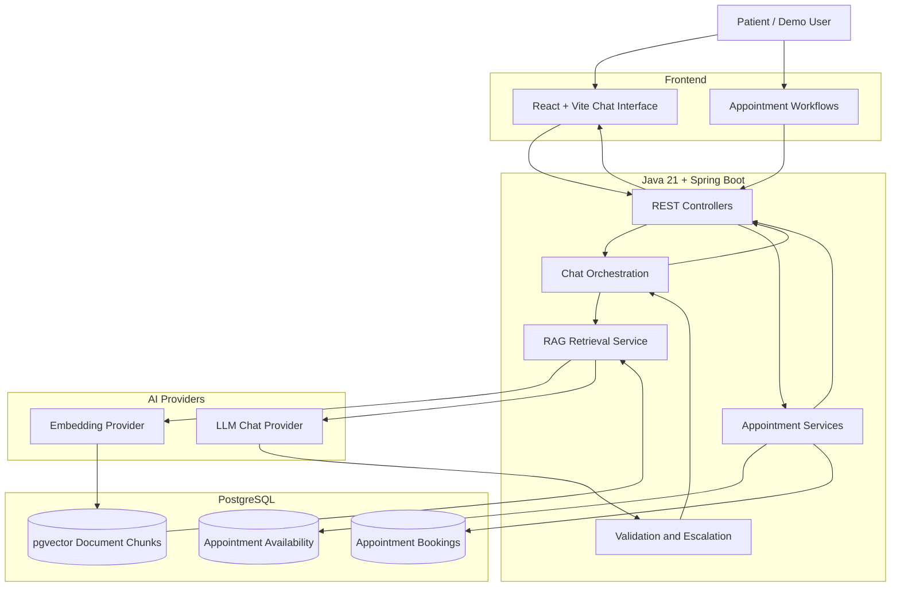

# MolarAI — System Architecture

MolarAI is an AI-powered support agent for a fictional dental clinic. It combines a React frontend, Spring Boot backend, PostgreSQL with pgvector, and LLM-powered knowledge retrieval.

## Core Components

- **Frontend:** React and Vite provide the chat experience and appointment workflows.
- **Backend:** Java 21 and Spring Boot expose REST APIs and coordinate application logic.
- **Knowledge retrieval:** Document chunks are stored in PostgreSQL with pgvector and retrieved for grounded responses.
- **AI integration:** Embedding and chat providers support retrieval and answer generation.
- **Appointment management:** Availability and booking operations use PostgreSQL.
- **Safety:** Input validation, answer validation, and escalation paths support safer demo interactions.

## Demo Scope

MolarAI is a fictional portfolio demonstration. It is not configured for real clinic operations, real patient data, or production SMS delivery.